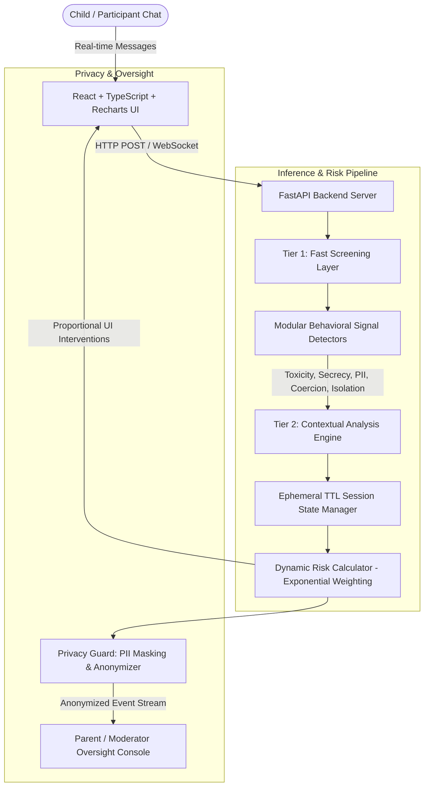

# SafeGuard AI — Proactive Child Online Safety & Digital Trust Layer

[](https://github.com)
[](https://fastapi.tiangolo.com/)
[](https://react.dev/)
[](https://scikit-learn.org/)
[](LICENSE)

> Protect children proactively by detecting escalating behavioral risk patterns in online conversations rather than relying only on keyword-based or user-reported moderation.

---

## 1. Project Overview

**SafeGuard AI** is a stateful, context-aware digital trust and child online safety engine. Traditional moderation tools are reactive and context-blind: they evaluate individual messages in isolation or wait until a user files a report. Predators, bullies, and manipulators bypass keyword filters by using innocuous words in early turns while gradually escalating pressure, requesting secrecy, and soliciting sensitive personal identifiable information (PII).

SafeGuard AI addresses this challenge by evaluating **multi-turn conversation context + behavioral signal extraction + dynamic risk progression** in real time, triggering proportional safety interventions before harm occurs while guaranteeing zero raw-chat persistence.

---

## 2. Problem Statement

Children engaging in online gaming, chat apps, and educational platforms face severe risks:
* **Grooming & Manipulation**: Gradual escalation from friendly small talk to isolation and secrecy.
* **PII & Credentials Solicitation**: Requests for home addresses, school names, phone numbers, passwords, or live locations.
* **Coercion & Blackmail**: Threats, emotional pressure, and urgency tactics ("do it right now or else").
* **Cyberbullying & Toxicity**: Repeated targeted harassment or hostile speech.

**Why Keyword Filters Fail**:
A message like *"Don't tell your mom about this"* or *"What school do you go to?"* contains no profanity or explicit bad words. In isolation, traditional moderation passes both messages. Together in sequence, they indicate a high-risk grooming attempt.

---

## 3. The Solution & Key Innovations

SafeGuard AI introduces a **Stateful Behavioral Analysis Architecture**:

1. **Contextual Pattern Recognition**: Evaluates conversation turns as a connected sequence rather than isolated events.
2. **Two-Tier Inference Pipeline**: Combines rapid, lightweight signal screening (Tier 1) with multi-turn contextual risk reasoning (Tier 2).
3. **Dynamic Exponential Risk Score ($R_t$)**: Calculates risk using an exponentially weighted memory equation that captures momentum and escalation.
4. **Privacy by Design**: Zero permanent raw-chat transcript storage, 15-minute ephemeral TTL in-memory state, and fully anonymized moderator oversight.
5. **Proportional Safety Interventions**: Delivers non-alarmist, supportive interventions tuned to 4 distinct risk levels (LOW, MEDIUM, HIGH, CRITICAL).

---

## 4. System Architecture



---

## 5. Risk Engine & Mathematical Formulation

SafeGuard AI updates conversation risk $R_t$ dynamically at turn $t$ using an **Exponentially Weighted Moving Average (EWMA)**:

$$R_t = \lambda R_{t-1} + (1 - \lambda) S_t$$

Where:
* $R_t$: Dynamic risk score at current turn (0 – 100).
* $R_{t-1}$: Accumulated risk score from previous turn.
* $\lambda$: Temporal memory decay factor (configurable, default = `0.7`).
* $S_t$: Combined weighted signal score for current turn.

### Combined Signal Score ($S_t$) Calculation

$$S_t = \min\left(100, \sum_{i} w_i \cdot \text{score}_i + \text{Bonus}_{\text{synergy}} + \text{Bonus}_{\text{escalation}}\right)$$

| Signal Category | Weight ($w_i$) | Description |
| :--- | :---: | :--- |
| **PII Solicitation** | `25.0` | Requests for location, address, phone number, school, or credentials. |
| **Secrecy Requests** | `25.0` | Instructions to hide chat, delete messages, or keep secrets from parents. |
| **Isolation Attempts** | `20.0` | Alienating child from parents/friends or pushing to off-platform apps. |
| **Coercion & Threat** | `20.0` | Pressuring compliance under threat, blackmail, or emotional manipulation. |
| **Toxicity & Abuse** | `10.0` | Hostile, abusive, or harassing speech patterns. |
| **Targeted Behavior** | `15.0` | Persistent targeted behavioral patterns repeated across turns. |

* **Multi-Pattern Synergy Bonus**: $+15.0$ if 2 or more distinct risk categories occur in the same message (e.g., Secrecy + PII Request).
* **Multi-Turn Escalation Bonus**: $+12.0$ per signal category repeated across recent historical turns.

---

## 6. Proportional Safety Risk Levels

| Risk Level | Score Range | System Action & Intervention |
| :--- | :---: | :--- |
| **LOW** | `0 – 29` | Normal conversation. No UI interruption; minimal monitoring indicator. |
| **MEDIUM** | `30 – 59` | Non-intrusive safety nudge: *"Safety reminder: avoid sharing personal info or passwords."* |
| **HIGH** | `60 – 79` | Visible safety warning: *"Potential safety concern detected. Consider pausing interaction and speaking with a trusted adult."* |
| **CRITICAL** | `80 – 100` | Critical intervention: Message content held/blurred in demo UI; guidance to end chat & contact trusted adult; anonymized event logged to moderator dashboard. |

---

## 7. Machine Learning Methodology & Evaluation

SafeGuard AI incorporates a machine learning NLP pipeline (`ml/train_and_evaluate.py`) trained on a synthetic child online safety dataset (`ml/dataset.py`) covering normal peer chats, secrecy requests, PII solicitations, coercion, and harassment.

* **Classifier**: Scikit-Learn hybrid NLP pipeline (TF-IDF N-grams + Modular Signal Vector Embeddings + Logistic Regression).
* **Evaluation Metrics**: Evaluated via stratified splits focusing on **Safety Recall**:
  * **Accuracy**: `80.0%`
  * **Precision**: `65.0%`
  * **Safety Recall**: `80.0%`
  * **F1-Score**: `0.714`

---

## 8. Privacy by Design Architecture

1. **Zero Raw-Chat Persistence**: Complete chat transcripts are processed strictly in volatile memory and are **never** saved to disk, databases, or log files.
2. **15-Minute Ephemeral TTL State**: In-memory session states expire automatically after 15 minutes of inactivity (`EphemeralSessionManager`).
3. **Anonymized Oversight Console**: Event logs display anonymized IDs (e.g., `ANON-8F32A9`) and signal metadata only. Parents/moderators cannot view private text.
4. **Automatic PII Guardrails**: Phone numbers (`[PHONE_NUMBER_PROTECTED]`), email addresses (`[EMAIL_PROTECTED]`), and passwords are masked before UI rendering.

---

## 9. Technology Stack

* **Frontend**: React 18, TypeScript, Vite, Recharts, Lucide Icons, Vanilla Glassmorphism CSS.
* **Backend**: Python 3.14, FastAPI, Pydantic v2, Uvicorn, WebSockets, Pytest.
* **Machine Learning**: Scikit-Learn, NumPy, SciPy, TF-IDF Vectorization.

---

## 10. Repository Structure

```
safeGuard AI/
├── backend/
│   ├── app/
│   │   ├── api/routes.py            # REST & WebSocket Endpoints
│   │   ├── main.py                  # FastAPI Application Entrypoint
│   │   ├── models/schemas.py        # Pydantic Schemas & Data Transfer Objects
│   │   ├── privacy/anonymizer.py    # PII Masking & ID Anonymization
│   │   ├── risk_engine/calculator.py# Dynamic Exponential EWMA Risk Engine
│   │   ├── services/
│   │   │   ├── session_service.py   # Ephemeral TTL Session State Manager
│   │   │   └── moderator_service.py # Anonymized Oversight Event Store
│   │   └── signal_detection/
│   │       └── detectors.py         # Modular Signal Extraction Engine
│   ├── tests/
│   │   └── test_safeguard.py        # Pytest Unit & Integration Test Suite
│   └── requirements.txt
├── frontend/
│   ├── src/
│   │   ├── components/              # ChatSimulator, LiveRiskMonitor, ModeratorDashboard, etc.
│   │   ├── services/api.ts          # Backend API Client & Client Fallback
│   │   ├── App.tsx                  # Root Navigation & Layout
│   │   └── index.css                # Glassmorphism Design System
│   ├── package.json
│   └── vite.config.ts
├── ml/
│   ├── dataset.py                   # Synthetic Child Safety Dataset
│   ├── train_and_evaluate.py        # ML Training & Metric Benchmark Script
│   └── model_metrics.json           # Serialized Evaluation Benchmarks
└── README.md
```

---

## 11. Quickstart — Running Locally

### Prerequisites
* Python 3.10+
* Node.js 18+

### 1. Run Backend Server
```powershell
# In root directory
$env:PYTHONPATH="backend"
.\venv\Scripts\python.exe -m uvicorn app.main:app --host 127.0.0.1 --port 8000 --reload
```
*API Swagger Documentation will be available at:* `http://127.0.0.1:8000/docs`

### 2. Run Frontend Application
```powershell
cd frontend
npm install
npm run dev
```
*Open your browser at:* `http://localhost:5173`

---

## 12. Running Tests & ML Evaluation

### Backend Test Suite
```powershell
$env:PYTHONPATH="backend"
.\venv\Scripts\python.exe -m pytest backend/tests
```

### ML Model Training & Benchmarking
```powershell
$env:PYTHONPATH="backend;."
.\venv\Scripts\python.exe -m ml.train_and_evaluate
```

---

## 13. Hackathon Presentation Scenarios

The application includes an automated **Demo Scenarios Player** (`ScenarioRunner.tsx`) to showcase all risk transitions within 2–3 minutes:

* **Scenario A — Normal Peer Chat**: Casual talk about homework/gaming. *(Expected Risk: LOW)*
* **Scenario B — Sensitive Info Request**: Asks for school name and phone number. *(Expected Risk: MEDIUM)*
* **Scenario C — Repeated Secrecy**: Demands hiding chat from parents & moving off-platform. *(Expected Risk: HIGH)*
* **Scenario D — Escalating Coercion & Threats**: Combines secrecy, PII solicitation, and blackmail threats. *(Expected Risk: CRITICAL)*

---

## 14. Ethical Considerations & Disclaimer

* **Prototype Disclaimer**: SafeGuard AI is a hackathon MVP decision-support prototype. It is not a replacement for human moderation, parental judgment, or law enforcement emergency services.
* **Risk Score Interpretation**: Dynamic risk scores represent technical anomaly indicators, not legal or psychological determinations.
* **False Positive Reduction**: Designed with weighted signal synergy to minimize unnecessary alerts while maintaining high safety recall for genuine threats.

---

## 15. Future Roadmap

* **Phase 1 (Current)**: Working Hackathon MVP with stateful risk scoring, explainable signals, anonymized dashboard, and scenario player.
* **Phase 2**: Platform SDKs & Direct Integrations for Discord, Roblox, and EdTech environments.
* **Phase 3**: On-device / Local Small Language Model (SLM) inference for zero-network edge privacy preservation.
